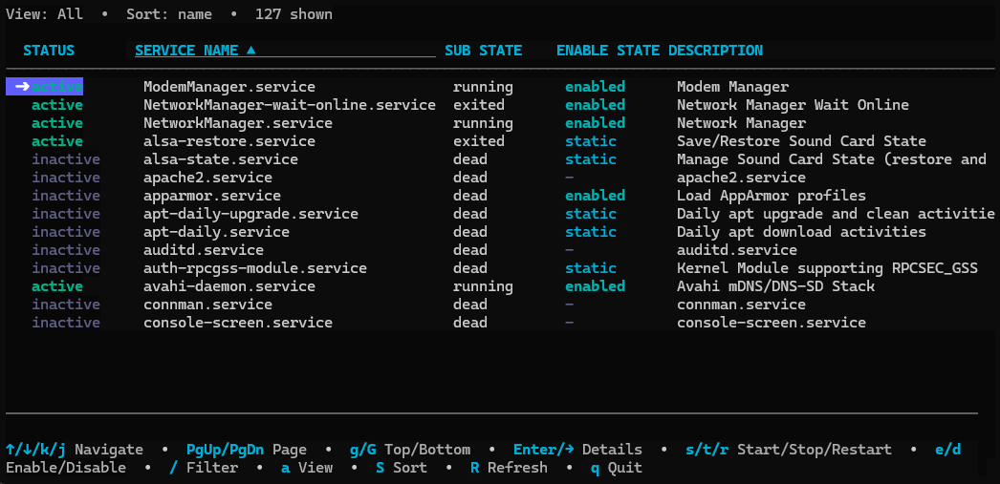
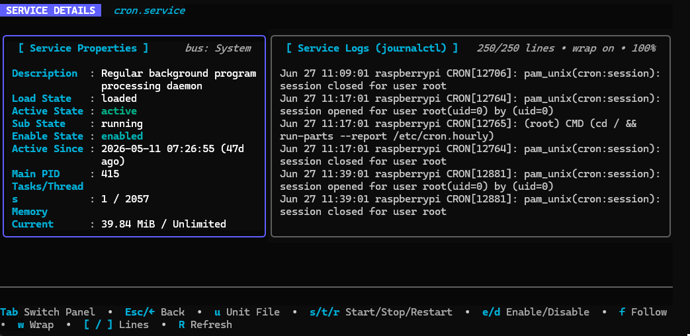
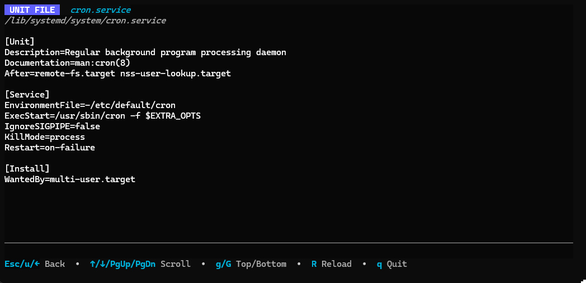

# jeeves

[](https://pkg.go.dev/github.com/aymanhs/jeeves)
[](https://goreportcard.com/report/github.com/aymanhs/jeeves)
[](LICENSE)
[](https://github.com/aymanhs/jeeves/releases/latest)

> _"You rang, sir?"_ — your terminal-native butler for systemd.

A fast, keyboard-driven TUI for systemd. Browse every unit on the box, watch
logs live, inspect unit files, restart things — without leaving the terminal
and without typing `sudo systemctl restart <tab><tab><tab>` ever again.



---

## Why?

`systemctl` is a great _command_. It's a lousy _interface_.

You want to know what's running, what's failed, what's eating RAM, what
`nginx.service` actually says, and why it died at 03:14 last night. You shouldn't
need eight terminal windows and a copy-paste pipeline through `awk` to find out.

**jeeves** is one screen, one keymap, and no surprises.

---

## Features

- 🚦 **Browse every service** — color-coded state, sub-state, enablement,
  description. Filter as you type with `/`. Cycle views with `a` (all /
  running / failed). Sort with `S` (name / state / memory / PID).
- 🔎 **Drill in** — split-panel detail view with properties on one side and
  live `journalctl` on the other. Memory, CPU, tasks, traffic, and uptime
  refresh every 2 seconds automatically.



- 📜 **Logs that don't lie** — wrap toggle (`w`), tail-line cycling (`[` / `]`,
  100 → 2,500), full scrollback (PgUp/PgDn/g/G), and a true follow mode (`f`)
  that streams `journalctl -f` straight into the panel without you reaching
  for another terminal.
- 📄 **Inspect the unit file** — press `u` for a full-screen, copy-pasteable
  view of the on-disk service file. No borders, no styling — just the bytes.



- 🛟 **Safety net** — destructive actions (`stop`, `restart`, `disable`,
  `mask`) ask `[y/N]` before they fire. You won't kill `sshd` with a stray
  keystroke.
- 🐭 **Mouse-friendly** — scroll wheel works in every viewport. Use it or
  don't; jeeves doesn't care.
- 🏠 **System or user bus** — `--user` for your own units, default for the
  system bus. Auto-falls-back when D-Bus says no.

---

## Install

Pick whichever is easiest:

**Prebuilt binary** (no Go required) — grab the right tarball for your
architecture from the [Releases page](https://github.com/aymanhs/jeeves/releases/latest).
Linux `amd64`, `arm64`, and `arm` (Pi 2/3/4/5) are all there.

```bash
# Example: Pi 3B+ / 4 / 5
curl -L https://github.com/aymanhs/jeeves/releases/latest/download/jeeves-linux-arm64.tar.gz \
  | tar xz
sudo install jeeves /usr/local/bin/
```

**Via Go:**

```bash
go install github.com/aymanhs/jeeves@latest
```

**From source:**

```bash
git clone https://github.com/aymanhs/jeeves
cd jeeves
go build -o jeeves .
```

### Requirements

- **OS:** Linux with systemd as PID 1. WSL2 works _only_ if you've enabled
  systemd in `/etc/wsl.conf`. macOS and the BSDs are not supported (no systemd).
- **systemd:** version 230 or newer (Debian 9+, Ubuntu 16.04+, RHEL/CentOS 8+,
  any current Arch/Fedora — anything from the last ~decade is fine). Older
  systemd is missing the `ListUnitsByPatterns` D-Bus method used for the fast
  startup path.
- **journalctl:** must be on `$PATH` (it always is on a systemd box; called
  out only because we shell out to it for log fetching).
- **Architecture:** amd64, arm64, arm (32-bit Pi). Everything is statically
  buildable — `GOOS=linux GOARCH=arm64 go build` on your dev box, `scp` the
  binary, done.

---

## Use

```bash
# Manage system units (most of what you care about — needs root for actions)
sudo jeeves

# Manage your user units (no sudo)
jeeves --user
```

### Permissions

- **Browsing system units:** no root needed. You can open jeeves as a normal
  user and see every system service.
- **Actions on system units** (start, stop, restart, enable, disable): require
  root or a polkit rule that grants your account `manage-units`. Without one
  of those, the action banner shows `permission denied (try running with sudo)`.
- **`--user` mode:** no root, but you only see your own user units. Good for
  poking at your `~/.config/systemd/user/` setup.

### Keymap

#### Service list

| Key                  | Action                                         |
|----------------------|------------------------------------------------|
| `↑/↓` `j/k`          | Navigate (wraps at top/bottom)                 |
| `PgUp/PgDn` `Ctrl+U/D` | Page up / down                               |
| `Home/End` `g/G`     | Jump to first / last                           |
| `Enter` `→` `l`      | Open details                                   |
| `/`                  | Filter as you type                             |
| `a`                  | Cycle view: all → running → failed             |
| `S`                  | Cycle sort: name → state → memory → PID (▲/▼ marks the active column) |
| `s` `t` `r`          | Start / Stop / Restart                         |
| `e` `d`              | Enable / Disable                               |
| `R`                  | Refresh                                        |
| `q` `Ctrl+C`         | Quit                                           |

#### Detail view

| Key          | Action                                          |
|--------------|-------------------------------------------------|
| `Tab`        | Switch focus: properties ↔ logs                 |
| `u`          | Open unit file (full screen)                    |
| `f`          | Follow logs (live tail)                         |
| `w`          | Toggle log line wrap                            |
| `[` / `]`    | Decrease / increase log tail length             |
| `s/t/r/e/d`  | Service actions (destructive ones prompt y/N)   |
| `↑/↓ PgUp/PgDn g/G` | Scroll logs                              |
| `R`          | Refresh                                         |
| `Esc` `←` `h`| Back to list                                    |

#### Unit-file view

Plain text, mouse-selectable, copy-pasteable. `R` to reload,
`Esc`/`u`/`←` to go back.

---

## Cache


To make startup instant on slow hardware (Pi 3B+, low-end ARM boxes), jeeves
caches the merged service list to disk after each run and paints it on the
next start while the live data is being fetched in the background. A
`(cached)` tag appears in the header — and a one-shot status banner — so you
always know when you're looking at cached vs live data.

- **What's cached:** the service list only (names, states, descriptions,
  enable-states). No logs, no unit-file contents, no actions.
- **Where:** `$XDG_CACHE_HOME/jeeves/` (typically `~/.cache/jeeves/`, or
  `/root/.cache/jeeves/` under sudo). One file per bus (`services-system.json`,
  `services-user.json`).
- **How long:** at most 7 days, then refetched from scratch.

```bash
jeeves --cache-info    # show where the cache is and what's in it
jeeves --clear-cache   # delete it
jeeves --no-cache      # skip the cache for this run (no read, no write)
```

---

## Status

Single-binary, no config file, no daemon, no telemetry. Talks to systemd via
D-Bus directly (no shelling out to `systemctl` for state — only for
`journalctl`). Tested on Debian, Ubuntu, Arch, Fedora. Daily-driver on a
Raspberry Pi 3B+.

---

## Contributing

Bugs and feature requests: [open an issue](https://github.com/aymanhs/jeeves/issues).
PRs welcome — keep them focused, and run `go vet ./...` before sending.

---

## Acknowledgements

Standing on the shoulders of giants:

- [Charm.sh](https://charm.sh) — [Bubble Tea](https://github.com/charmbracelet/bubbletea),
  [Bubbles](https://github.com/charmbracelet/bubbles), and
  [Lipgloss](https://github.com/charmbracelet/lipgloss) do the TUI heavy
  lifting. If you're building a Go TUI, start there.
- [coreos/go-systemd](https://github.com/coreos/go-systemd) — the D-Bus
  bindings that let jeeves talk to systemd without shelling out to `systemctl`.

---

## License

MIT. See [LICENSE](LICENSE).
